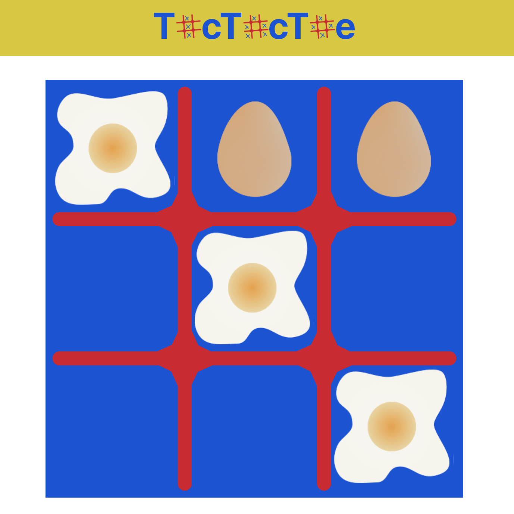

# ReacTacToe 

## Why
Full disclosure: I hate tic tac toe. I never found the game interesting, and people seemed to want to play it again and again. One game, people! This is not riveting enough to carry me through scores of rounds. 

I never understood why it was so popular for part of learning how to program and just ignored it. No way could naughts and crosses keep me interested between git init and the final push. So I was wrong. The point is that winning combo check. Now that was fun. And who said I had to stick with Xs and Os? Changed that up, too, which became its own challenge.

So here I am: a girl (very old one at that) standing before you and admitting that this was so fun to make for design and algorithmofun. 

## What
Tic Tac Toe or Naughts and Crosses or Whole Egg and Splats
A basic tic tac toe game (can there be anything but a basic version of this?) but with O-ish and X-ish images instead of X and O. 

## How
* Create React App
* Styled Components
* Sketch

https://blog.alexdevero.com/how-to-build-simple-tic-tac-toe-game-with-react/